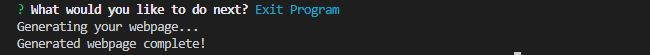
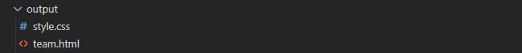

# Team Profile Generator

  

 
  
## Table of Contents

- [Description](#description)
- [Installation](#installation)
- [Usage](#usage)
- [Contributing](#contributing)
- [Tests](#tests)
- [License](#license)

 

## Description

This is a Node.js command-line application that allows a user to enter information about employees on their software engineering team, then generate an HTML webpage that displays summaries for each person dynamically. It uses ES6 classes to create objects based off the information entered.

This project utilizes the [`Inquirer`](https://www.npmjs.com/package/inquirer) package to collect input from users through prompt and has passed testing stage by the [`Jest`](https://www.npmjs.com/package/jest) package.

 

## Installation

Download the file from repo to your machine. Go into the file directory in the terminal and install the packages by running `npm install` to download the Inquirer and Jest packages.

Application can also be accessed at here [YueHuaHua GitHub repository👾](https://github.com/YueHuaHua/module-08-challenge).

 

## Usage

Start the application by typing `node index.js` command or `npm start`. Answer each question required to create employee profiles, and the webpage will be generated in the `output` folder on your machine. Watch this 📽 [video](assets/img/demo-video.mp4) to see the demo or click [here](https://www.dropbox.com/s/spktbbim3tqmhmv/demo-video.mp4?dl=0) to download.

1. Invoke the application by typing `node index.js`.

2. Starting the application prompts with information for the manager, then prompts for what to do next.

3. Selecting `Engineer` gives a series of prompts specific to the engineer.

4. Selecting `Intern` gives a series of prompts specific to the intern.

5. Selecting `Exit program` ends the application.

6. Check the freshly generated `team.html` webpage file in the `output` folder. 
 
7. Open the `team.html` file in the browser to see the result.
 

 

## Contributing

Please take a look at our contributing guidelines below if you're interested in helping!

1. Clone the project onto your machine
2. Contribute and make a pull request to be reviewed.

 

## Tests

Test the application by typing `npm i jest` in the terminal. This application has passed the test by [`Jest`](https://www.npmjs.com/package/jest) package.

 

## License

Licensed under the [MIT license](https://github.com/git/git-scm.com/blob/main/MIT-LICENSE.txt). See LICENSE for the full details.
